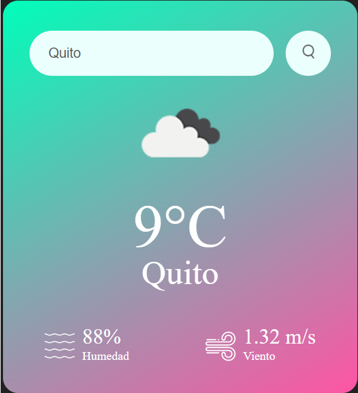

# Weather App

Una aplicación para buscar el clima dada una ciudad.

## Screenshots

## Run locally

Para desplegar basta con utilizar un live server

- Añadir un archivo keys.js y dentro de este agregar una constante llamada "apiKey" y exportándola, colocando la llave de la api para obtener el clima que se puede obtener en https://openweathermap.org/

